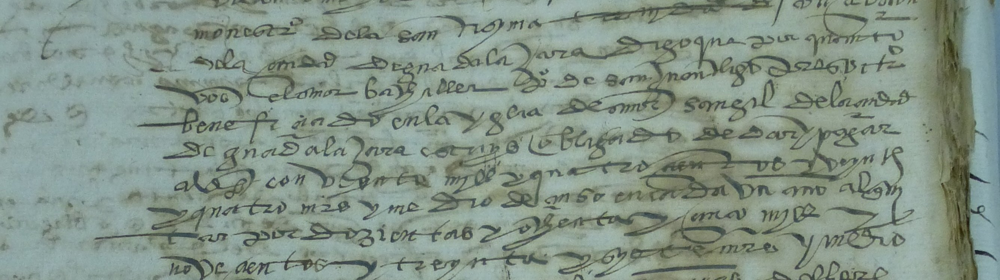
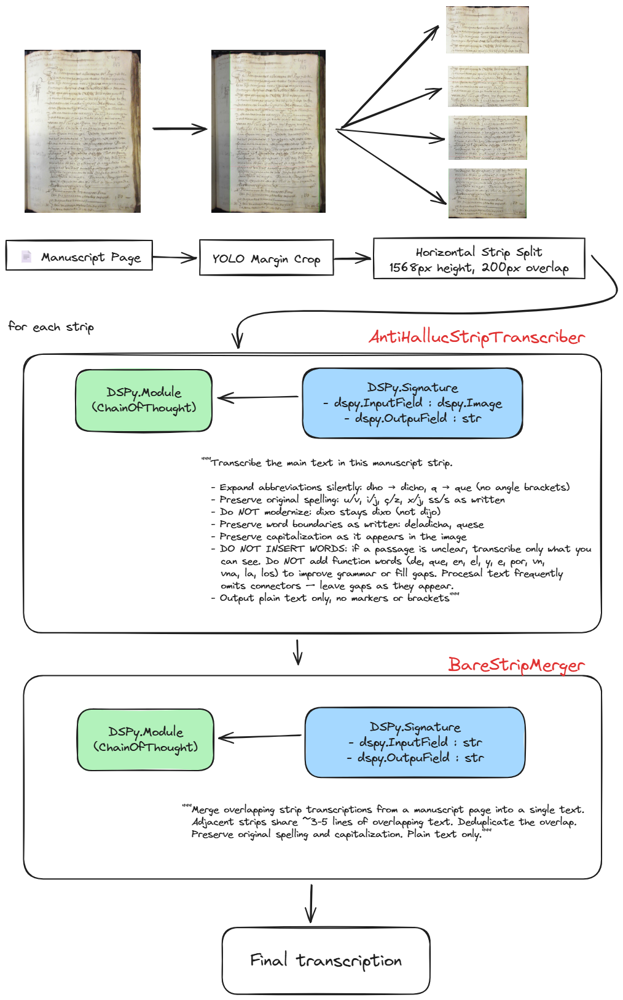
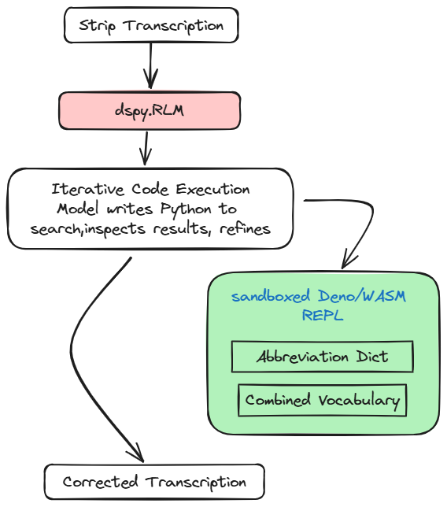

<p align="center">
  
</p>

# Paleo-OCR: HTR Benchmark for 16th-Century Spanish Manuscripts

Systematic evaluation of Handwritten Text Recognition (HTR) techniques on *letra procesal* — one of the most challenging historical scripts for both human readers and automated systems. This project compares 9 transcription models and a series of agentic VLM (Vision Language Model) pipelines on 55 manuscript pages from two corpora.

**Key finding**: Transkribus Spanish Sage (a fine-tuned HTR model) leads overall at **38.3% CER (Character Error Rate)** across all 55 pages, but a simple agentic VLM pipeline — YOLO (You Only Look Once) margin crop + strip splitting + LLM (Large Language Model) merge — achieves **38.6%**, competitive without any fine-tuning. **Image resolution is the dominant factor** in VLM HTR performance.

## Table of Contents

- [Project Structure](#project-structure)
- [Results](#results)
- [Image Resolution — The Dominant Factor in VLM HTR](#image-resolution--the-dominant-factor-in-vlm-htr)
  - [VLM Resolution Limits Per Provider](#vlm-resolution-limits-per-provider)
  - [Resolution Experiment — Measured Data](#resolution-experiment--measured-data)
- [The Agentic Pipeline — Evolution and Findings](#the-agentic-pipeline--evolution-and-findings)
  - [Final Pipeline](#final-pipeline)
  - [Ablation Study](#what-worked-and-what-didnt)
  - [DSPy for Visual Tasks — Lessons Learned](#dspy-for-visual-tasks--lessons-learned)
    - [DSPy RLM — Programmatic Knowledge Lookup](#dspy-rlm--programmatic-knowledge-lookup)
- [Evaluation Methodology](#evaluation-methodology)
  - [Multi-Tier Metrics](#multi-tier-metrics)
  - [CHARTA Conventions and the CER Normalization Gap](#charta-conventions-and-the-cer-normalization-gap)
  - [Ground Truth Quality Verification](#ground-truth-quality-verification)
  - [Ground Truth Sources](#ground-truth-sources)
- [Related Work and References](#related-work-and-references)
- [License](#license)
- [Acknowledgments](#acknowledgments)

## Project Structure

```
paleo-ocr/
├── assets/                          # Diagrams and header image
├── data/
│   ├── abbreviations/               # Scholarly + empirical abbreviation dictionaries
│   ├── vocabularies/                # Historical Spanish word lists (CHARTA, CODEA, IMPACT-es)
│   ├── corpora/                     # Source manuscripts and ground truth
│   │   ├── codea/                   #   CODEA+ 2022 corpus (100 documents, paleographic + critical GT)
│   │   └── toledo/                  #   Toledo Municipal Archive (15 documents, editorial GT)
│   ├── subsets/                     # Curated 55-page evaluation set
│   ├── results/
│   │   ├── baseline/                #   Transcriptions from 9 models
│   │   ├── pipeline/                #   Transcriptions from 17 pipeline iterations
│   │   └── _experiments/            #   19 ablation studies (resolution, knowledge injection, RLM)
│   ├── evaluation/                  # Metric reports, summary tables, error visualizations
│   └── optimization/                # Optimized DSPy programs and dataset splits
├── scripts/
│   ├── dspy_pipeline/               # Core DSPy modules (transcriber, merger, config, metrics)
│   ├── evaluation/                  # Metric computation (CER, Romein tiers, statistical tests)
│   ├── acquisition/                 # Corpus download and extraction
│   ├── preparation/                 # Ground truth normalization and subset selection
│   ├── transcription/               # Baseline model runners (OpenRouter, resolution experiment)
│   ├── review/                      # HTML comparison and visualization generators
│   └── analysis/                    # Ground truth statistics
├── notebooks/                       # Colab notebooks for specialist models (CHURRO, TRIDIS, Qwen3)
├── tests/                           # Cross-validation against jiwer, rapidfuzz, scipy, statsmodels
└── pyproject.toml                   # Dependencies (optional groups: eval, vlm, dspy, agentic, test)
```

## Results

Evaluated on [55 pages from two corpora](#ground-truth-sources). CER (Character Error Rate) computed at four [Romein normalization tiers](https://link.springer.com/article/10.1007/s42803-025-00100-0) (Romein et al. 2025), which progressively strip editorial conventions to isolate pure reading accuracy:

- **T1 raw** — standard CER, no normalization
- **T2 no-space** — remove whitespace (strips word boundary conventions — the largest convention cost at ~6% CER)
- **T3 lowercase** — + case-fold (strips capitalization conventions)
- **T4 alphanumeric** — + strip special characters (ç, &, punctuation) — **pure character reading accuracy**

| Rank | Model | Type | T1 raw | T2 no-sp | T3 lower | T4 alnum | NLS |
|------|-------|------|--------|----------|----------|----------|-----|
| **1** | **Transkribus Spanish Sage** | **Fine-tuned HTR** | **38.3%** | **30.3%** | **29.0%** | **27.8%** | **0.645** |
| 2 | YOLO crop + strip pipeline | Agentic VLM | 38.6% | 32.0% | 30.7% | 30.2% | 0.626 |
| 3 | Claude Opus 4.6 | Zero-shot VLM | 43.8% | 36.3% | 35.2% | 34.0% | 0.579 |
| 4 | TRIDIS v2 | Specialist HTR | 49.8% | 40.5% | 39.6% | 38.7% | 0.510 |
| 5 | Google Cloud Vision | Legacy OCR | 59.7% | 49.8% | 48.9% | 47.9% | 0.404 |
| 6 | GPT-5.4 | Zero-shot VLM | 61.2% | 51.3% | 50.7% | 49.9% | 0.388 |
| 7 | Mistral Large 3 | Zero-shot VLM | 73.9% | 62.7% | 61.9% | 60.4% | 0.335 |
| 8 | Gemini 3.1 Pro | Zero-shot VLM | 75.8% | 63.4% | 62.8% | 61.6% | 0.242 |
| 9 | Qwen3-VL 8B | Specialist VLM | 144.1% | 113.6% | 112.5% | 107.0% | 0.325 |
| 10 | CHURRO-3B | Specialist HTR | 239.1% | 195.1% | 194.2% | 191.8% | 0.458 |

T1 raw = standard CER (Character Error Rate, lower is better — can exceed 100% when model hallucinates). NLS = Normalized Levenshtein Similarity (higher is better). [Full metrics](data/evaluation/full_metrics.md) including CER_n, WER, error decomposition (precision, recall, substitution/deletion/insertion rates), and order-independent metrics (BOC, Δ-CER).

An [interactive error comparison](https://crlsrmrlsz.github.io/paleo-ocr/error_comparison.html) shows a manuscript page alongside the ground truth and model transcription with character-level error highlighting (substitutions, deletions, insertions).

## Image Resolution — The Dominant Factor in VLM HTR

The most impactful and least documented finding of this project: **VLM image resolution limits are the dominant factor in HTR performance** — more important than model architecture, prompt engineering, or domain knowledge.

### VLM Resolution Limits Per Provider

Each VLM provider imposes a hard limit on the longest image dimension. Images exceeding this are silently downscaled — the API accepts the full image but the model never sees it at full resolution:

| Provider | Max Long Side | Architecture | 
|----------|--------------|--------------|
| [**Claude Opus 4.6** (Anthropic)](https://platform.claude.com/docs/en/docs/build-with-claude/vision) | **1,568 px** | Separate ViT encoder + LLM | 
| [Gemini 3.1 Pro (Google)](https://ai.google.dev/gemini-api/docs/media-resolution) | 3,072 px | Unified MoE, 768px tiling | 
| [GPT-5.4 (OpenAI)](https://platform.openai.com/docs/guides/images-vision) | 6,000 px | Unified transformer, 512px tiling | 

**Practical impact**: CODEA manuscript images average 2,672 x 4,000 px (10.7 MP). When Claude processes a full page, it downscales to 1,568 px on the longest side — each character appears at **0.44x its original size**. Abbreviation marks, letter ascenders/descenders, and the fine distinctions between procesal letterforms (n vs u, c vs e, m vs rn) are lost in the downscaling.

### Resolution Experiment — Measured Data

To quantify the resolution effect, we tested Claude Opus 4.6 on 5 high-performing CODEA pages at 5 input resolutions. Same model, same prompt — only image size changes ([Lanczos](https://en.wikipedia.org/wiki/Lanczos_resampling) downscale before sending). Re-run with `scripts/transcription/run_resolution_experiment.py`.

| Input Resolution | Mean CER | vs 1568px | What Happens |
|-----------------|---------|-----------|--------------|
| 3,072 px | 18.3% | -0.2% | Claude caps internally at 1568 — extra pixels wasted |
| **1,568 px** | **18.4%** | **baseline** | **Claude's native limit — optimal input size** |
| 1,024 px | 21.7% | +3.2% | Moderate detail loss — some letterforms ambiguous |
| 768 px | 31.8% | +13.3% | Significant loss — abbreviation marks disappear |
| 512 px | 57.4% | +38.9% | Severe — procesal text effectively illegible |

**Key findings**:
- **3072px and 1568px give identical CER** (18.3% vs 18.4%) — confirming Claude silently caps at 1568px. Sending higher resolution images wastes bandwidth and tokens without any quality benefit.
- **Below 1568px, CER degrades monotonically** — each resolution step loses fine handwriting details. From 1568px to 768px, CER nearly doubles (+13.3%); from 768px to 512px, it nearly doubles again (+25.6%).
- **Resolution explains more CER variance than any prompt or knowledge technique tested** — the 38.9% CER gap between 1568px and 512px dwarfs the <1% improvements from all domain knowledge, prompt optimization, and post-processing techniques combined (13 experiments).

## The Agentic Pipeline — Evolution and Findings

The core research question: **can a simple agentic workflow beat specialist HTR models?** We tested 11 pipeline variants systematically, each isolating one variable. This was the best performer:

<p align="center">
  
</p>

The winning pipeline is remarkably simple — no page analysis, no domain knowledge, no post-processing:

1. **YOLO margin crop** — [YOLOv11](https://docs.ultralytics.com/) object detection with weights from [`biglam/medieval-manuscript-yolov11`](https://huggingface.co/biglam/medieval-manuscript-yolov11), pretrained on the [CATMuS Medieval Segmentation](https://huggingface.co/datasets/CATMuS/medieval-segmentation) dataset (1,680 annotated manuscript pages, 8th–16th century). We use it only for margin cropping: detect text regions at confidence 0.05 for margin detection (general YOLO detection uses 0.25), crop left/right margins (keep full height), fall back to full image if confidence < 0.60 or detected area < 50% of page. This reduces strip width by ~20% on average, improving effective resolution from ~58% to ~74% of native.
2. **Horizontal strip split** — split cropped area into 1568px-tall strips with 200px overlap.
3. **Transcribe each strip** — Claude Opus 4.6 via DSPy, image only, with anti-hallucination instruction ("don't insert function words").
4. **Merge strips** — LLM deduplicates overlap between adjacent strips. No context, no page description.

### Ablation Study

We ran extensive experiments to understand what actually improves HTR accuracy. The core hypothesis was that **domain knowledge should help** — if the model knows what abbreviations look like, which letterforms are confusable, and what period-correct spelling rules apply, it should make fewer errors. This turned out to be wrong.

1. **The knowledge approach (failed).** We tested 13 techniques for injecting domain knowledge into the pipeline. **None reduced CER.** The techniques, grouped by category:

   - **Paleographic references** — abbreviation dictionaries, letterform confusion guides (pairs like n↔u, c↔e), period spelling rules (alternations like ç↔c, v↔u), transcription criteria from the CHARTA standard
   - **Pipeline context** — page-level analysis providing context to the transcriber, cross-page document memory, independent critic review by a second model
   - **Post-processing** — vocabulary-guided post-correction (93K-word historical Spanish lexicon, 36 parameter combinations), compound word joining (8,450 forms), coherence detection with re-transcription of garbled zones
   - **Automated optimization** — text-only prompt optimization (MIPROv2), multimodal prompt optimization (GEPA), [`dspy.RLM`](#dspy-rlm--programmatic-knowledge-lookup) programmatic lookup via sandboxed Python REPL

   **Why none worked:** the model already knows common abbreviation expansions from its training data, automated correction replaces correct rare words with wrong common ones, and providing reading guides or context actually adds noise — the model reads procesal script better without being told what to expect.

2. **The resolution approach (worked).** Cropping empty margins before splitting strips improved CER by 1.3% — each strip contains more text at higher effective resolution. This single physical optimization outperformed all 13 knowledge techniques combined.

3. **The simplicity approach (worked).** A minimal anti-hallucination instruction ("don't insert function words") improved CER by 0.3% — the only prompt change that helped. **Simpler merge rules consistently beat more elaborate ones**. Every attempt to add intelligence made things worse.

**Why knowledge fails for visual HTR.** ~70% of errors are fundamental visual perception failures — the model cannot distinguish certain procesal letterforms (n vs u, c vs e, m vs rn) at any resolution. The remaining ~30% are convention mismatches (word boundaries, function word insertion) where both forms are linguistically valid. The bottleneck is **what the model can see**, not what it knows. Domain knowledge approaches that work for text-only NLP do not transfer to vision tasks where input signal quality is the limiting factor.

### DSPy for Visual Tasks — Lessons Learned

[DSPy](https://dspy.ai/) is a framework for programming language models with automatic prompt optimization. We used DSPy 2.6+ throughout this project. The pipeline architecture is shown [above](#the-agentic-pipeline--evolution-and-findings).

**What worked:** `dspy.ChainOfThought` adds reasoning traces that help the model think through difficult letterforms. `dspy.Signature` docstrings become the system instruction — the anti-hallucination rules live directly in the module definition. `dspy.Image` handles multimodal input cleanly. Module composition (`AntiHallucStripTranscriber` → `BareStripMerger`) keeps the pipeline readable.

**What didn't work — and why.** We tested three DSPy optimization approaches, plus `dspy.RLM` for programmatic knowledge lookup. All failed for the same reason: the bottleneck is visual, not textual.

- **`MIPROv2` optimizer** — text-only instruction proposer cannot analyze `dspy.Image` content; `data_aware_proposer` serializes images as base64 noise
- **`GEPA` with `MultiModalInstructionProposer`** — generates detailed 10K+ char instructions by seeing images, but instructions that score well on 3-page subsamples don't generalize to diverse documents
- **Domain knowledge `InputField`s** — adding abbreviation tables, confusion pairs, or spelling rules to prompts doesn't help when the model can't read the letterforms

#### DSPy RLM — Programmatic Knowledge Lookup

[`dspy.RLM`](https://dspy.ai/api/modules/RLM/) (Recursive Language Model, [Zhang et al. 2025](https://arxiv.org/abs/2512.24601)) gives the model a sandboxed Python REPL to programmatically search abbreviation dictionaries and vocabularies — without fitting them into the prompt context.

<p align="center">
  
</p>

The complete reference data is documented in [`data/abbreviations/`](data/abbreviations/) (182 scholarly entries + 2,105 empirical instances from CODEA GT) and [`data/vocabularies/`](data/vocabularies/) (~85K unique historical word forms from three complementary sources: CHARTA corpus, CODEA paleographic GT, and IMPACT-es historical lexicon).

**What we tested**: We ran RLM as a post-correction step across three configurations — page-level correction (5 pages), per-strip correction (2 pages), and per-strip with a critic review module. The RLM had access to a flat abbreviation dictionary (182 entries) via its sandboxed Python REPL, with 10 iterations and 20 LLM calls per invocation.

**Results**: Page-level RLM increased CER by +1.44% (worse). Per-strip RLM showed mixed results: −2.94% on one page but +1.90% on another, averaging −0.52% — too unstable to be useful.

**Why it failed**: The core issue is that ~70% of transcription errors are visual perception failures (confusing n/u, c/e, m/rn in *procesal* handwriting), not knowledge gaps. RLM addresses the textual side — abbreviation expansion — but can't fix what the model misread from the image. Additionally: (1) common expansions like dho→dicho and q→que are already in the LLM's training data, so the dictionary added no new information; (2) without strong constraints on what constitutes an abbreviation, the model over-expanded — applying corrections to modern archival marks and non-abbreviated words, introducing net insertions that worsened accuracy.

**Key insight**: DSPy optimizes the *textual* component of prompts. When performance is bounded by the *visual* component (image resolution, encoder architecture), prompt optimization has no lever to pull.

## Evaluation Methodology

### Multi-Tier Metrics

| Category | Metrics | Purpose |
|----------|---------|---------|
| **Core** | CER, CER_n (bounded 0-1), NLS, WER (Word Error Rate), SER (Sentence Error Rate) | Standard HTR evaluation |
| **Romein diagnostic** | T1 raw → T2 no-space → T3 lowercase → T4 alphanumeric | Isolate error sources progressively |
| **Error decomposition** | Precision, Recall, F1, Substitution/Deletion/Insertion rates | Understand what type of errors dominate |
| **Order-independent** | BOC (Bag of Characters), delta-CER | Separate reading order errors from recognition errors |
| **Semantic** | Sentence embedding similarity, NER (Named Entity Recognition) fuzzy capture | Downstream task relevance |
| **Statistical** | Bootstrap CIs (10K resamples), Wilcoxon pairwise, Holm-Bonferroni | Significance testing across models |

### CHARTA Conventions and the CER Normalization Gap

The CODEA paleographic ground truth follows [CHARTA 2013 criteria](https://corpora.uah.es/charta/web/Criterios_CHARTA_11abr2013.pdf) — a philological standard that preserves the scribe's graphic system while silently expanding abbreviations. This creates a systematic **normalization gap**: the GT (Ground Truth) encodes editorial conventions that no VLM will naturally reproduce, inflating CER beyond what visual perception errors alone would cause.

#### What CHARTA paleographic transcription preserves

| Convention | Example in GT | What VLMs produce | Why it mismatches |
|-----------|---------------|-------------------|-------------------|
| **Vocalic j** | `Reconoçimjento`, `mjsmo`, `mja` | `Reconocimiento`, `mismo`, `mia` | Modern Spanish never uses `j` as a vowel — models regularize |
| **Initial v for u** | `vna`, `vn`, `vieron` | `una`, `un`, `vieron` (inconsistent) | Models apply modern u/v distribution |
| **Cedilla (ç)** | `çenso`, `çibdad`, `françisco` | `censo`, `ciudad`, `francisco` | Models drop cedillas or modernize |
| **Double nn** | `sennor`, `anno`, `vinna` | `señor`, `año`, `viña` | Models produce modern ñ |
| **Tironian sign** | `&` (for *et/e/y*) | `e`, `y` | Models read the glyph as a word |
| **Joined words** | `delaçibdad`, `mevendio`, `dezmeria` | `de la ciudad`, `me vendio` | Models apply modern word separation |
| **Notarial capitals** | `Requerido`, `Razon`, `Reconozco` | `requerido`, `razon`, `reconozco` | Models apply modern capitalization |

#### Quantified impact — Romein diagnostic tiers

The Romein tier framework (Romein et al. 2025) progressively strips each convention layer, isolating its contribution to CER. Example from Claude Opus 4.6 on CODEA-0143 (1549, procesal):

| Tier | Normalization | CER | Delta | What it reveals |
|------|--------------|-----|-------|-----------------|
| T1 raw | None | 35.6% | — | Full mismatch |
| T2 no-space | Remove spaces | 30.3% | **-5.3%** | Word boundary conventions |
| T3 lowercase | + lowercase | 30.0% | -0.3% | Capitalization conventions |
| T4 alphanumeric | + strip ç, &, punctuation | 29.6% | -0.4% | Special character conventions |

**Convention overhead: ~6% CER.** Of the 35.6% total CER, approximately 6 percentage points come from CHARTA conventions the model was never taught — not from visual perception failures. The remaining ~30% is genuine misreading of procesal letterforms. Word boundary conventions alone account for 5.3%, making them the largest non-visual error source.

#### Why this matters for interpreting results

The paleographic GT occupies a middle ground that no VLM naturally targets:

- It is **not a diplomatic transcription** (which would reproduce every stroke and abbreviation mark literally)
- It is **not a modern reading** (which would fully normalize spelling)
- It is a **philological interpretation** that expands abbreviations while preserving the original graphic system

A VLM naturally produces something between a modern reading and a critical edition — regularizing u/v, i/j, dropping cedillas, separating words, applying modern capitalization. This is closer to the CHARTA critical edition, but still not identical (because critical editions preserve sibilant distinctions like `fazer`/`hacer`, b/v as written, and apply accent marks for historical prosody).

When comparing CER across models, the convention overhead varies: VLMs naturally preserve some archaic forms (~8-9% T1→T4 gap), while fine-tuned HTR models normalize more aggressively (~10-11% gap). This means **T1 rankings can differ from T4 rankings** — the pipeline beats Transkribus at T1 on CODEA paleographic but loses at T4, because their convention costs differ. A model reading procesal script perfectly but ignoring CHARTA conventions would still report ~6% CER.

### Ground Truth Quality Verification

- Cross-library validation: CER computed with rapidfuzz, jiwer, and editdistance — results match within floating-point tolerance
- Synthetic test cases with known edit distances
- Romein tier monotonicity verified: T1 >= T2 >= T3 >= T4 by construction
- GT marker handling: `content` mode extracts text from `[firma: name]`, `[margen: text]`, removes empty markers `[rubrica]`, `[cruz]` before CER computation

### Ground Truth Sources

| Corpus | Documents | GT Pages | Evaluated | Period | Script Type | GT Edition | Source |
|--------|-----------|----------|-----------|--------|-------------|------------|--------|
| [CODEA+ 2022](https://corpuscodea.es/) | 15 | 41 | 37 | XVI-XVII c. | Procesal, procesal encadenada | Paleographic + Critical | University of Alcala |
| [Toledo Municipal Archive](https://www.toledo.es/patrimonio-cultural/archivo-municipal/) | 12 | 18 | 18 | XVI-XVII c. | Procesal | Editorial | Toledo City Council |

**55 pages evaluated.** 4 CODEA pages excluded: 3 reverse ink bleed (text from verso shows through), 1 incomplete GT.

CODEA transcription follows [CHARTA 2013 criteria](https://corpora.uah.es/charta/web/Criterios_CHARTA_11abr2013.pdf) — the standard for editing historical Spanish documents. Key rules: preserve original spelling (u/v, i/j, c/z as written), expand abbreviations silently, preserve word boundaries as written.

## Related Work and References

### HTR Evaluation Methods

- Romein, C.A. et al. (2025). ""; Digital Scholarship in the Humanities. DOI: [10.1007/s42803-025-00100-0](https://link.springer.com/article/10.1007/s42803-025-00100-0). Introduces the 4-tier normalization framework used in this project.
- Neudecker, C. (2021). "A Survey of OCR Evaluation Tools and Metrics." HIP'21/ACM. DOI: [10.1145/3476887.3476888](https://dl.acm.org/doi/10.1145/3476887.3476888). Defines CER_n (bounded, normalized).
- Clausner, S., Pletschacher, S. & Antonacopoulos, A. (2020). "Efficient and effective OCR engine training." Pattern Recognition Letters. DOI: [10.1016/j.patrec.2020.01.003](https://www.sciencedirect.com/science/article/abs/pii/S0031320319302006).
- Jaud, M. et al. (2025). "Impact of OCR Errors on Key Term Detection." JCDL. Demonstrated that errors on named entities matter more than errors on common words for information retrieval tasks.
- Backer, C.P. & Hyman, M.D. (2025). NLP4DH Workshop. Argued standard metrics underestimate performance gains for historical research.

### Historical Spanish Paleography

- CHARTA Network (2013). *Criterios de edicion de documentos hispanicos (Origenes-siglo XIX)*. [PDF](https://corpora.uah.es/charta/web/Criterios_CHARTA_11abr2013.pdf). Official transcription criteria for CODEA corpus.
- Carlin, M.A. (1999). *A Paleographic Guide to Spanish Abbreviations 1500-1700*. 1000+ abbreviation entries from original documents.
- Riesco Terrero, A. (1983). *Diccionario de abreviaturas hispanas de los siglos XIII al XVIII*. Comprehensive 620-page reference dictionary (included in repo via git-lfs).
- Ueda, H. (2015). Historical abbreviation frequency analysis across 28 Spanish manuscripts (13th-19th century). Established frequency rankings for abbreviation patterns.
- Tolosa Robledo, L. et al. (2006). Economic document analysis from 18th-century Tucuman residencia proceedings (807 folios).

### HTR Models and SOTA

- Murrieta-Flores, P. et al. (2025). "Unlocking colonial records with AI." Taylor & Francis. DOI: [10.1080/20548923.2025.2484828](https://www.tandfonline.com/doi/full/10.1080/20548923.2025.2484828). Achieved 14.15% CER on procesal simple with fine-tuned Transkribus. Key finding: image resolution is statistically significant (p<0.001) — low-res 26% CER vs high-res 14.5% CER.
- Crosilla, L. et al. (2025). "LLM-based HTR post-correction." Journal of Documentation. arXiv: [2503.15195](https://arxiv.org/abs/2503.15195).
- Greif, S. et al. (2025). "Gemini-based historical OCR correction." arXiv: [2504.00414](https://arxiv.org/abs/2504.00414). Achieved 0.84% normalized CER using VLM + LLM post-correction on historical German city directories.
- Isom, C. (2025). "Domain-knowledge-augmented HTR correction." arXiv: [2507.04132](https://arxiv.org/abs/2507.04132). Three-stage pipeline with abbreviation dictionaries.
- Kanerva, J. et al. (2025). "LLM correction for historical OCR." ACL/RESOURCEFUL. arXiv: [2502.01205](https://arxiv.org/abs/2502.01205). LLM correction reduces CER 30-50% on historical OCR.
- Rijhwani, S. et al. (2025). "CHURRO: A Large-Scale HTR Model." Stanford NLP. [GitHub](https://github.com/stanford-oval/Churro).
- Chague, A. et al. (2022). "CATMuS Medieval Segmentation." HAL: [hal-03828353v4](https://hal.science/hal-03828353v4). Dataset used to train the YOLO layout detection model.

### Layout Detection

- "From Codicology to Code" (2025). ICDAR. arXiv: [2506.20326](https://arxiv.org/abs/2506.20326). YOLOv11x-OBB achieves best mAP (0.564) on medieval manuscript layout analysis. Key finding: "Oriented Bounding Boxes are not a minor refinement but a fundamental necessity."
- "YALTAi: YOLO-based layout analysis" (2022). arXiv: [2207.11230](https://arxiv.org/abs/2207.11230). Replaces pixel segmentation with object detection for region detection.
- "From Parchment to Pixels" (2025). KBLab. [Blog](https://kb-labb.github.io/posts/2025-06-11-from-parchment-to-pixel/). Kraken segmentation on medieval Swedish manuscripts.

### VLM Image Processing

- Qwen2-VL (2024). arXiv: [2409.12191](https://arxiv.org/abs/2409.12191). Naive Dynamic Resolution with `min_pixels`/`max_pixels` tiling budget.
- DeepSeek-OCR (2025). arXiv: [2510.18234](https://arxiv.org/abs/2510.18234). Dynamic tiling with 640-1024px tiles.
- GOT-OCR 2.0 (2024). arXiv: [2409.01704](https://arxiv.org/abs/2409.01704). 1024px sliding window for full-page OCR.

### DSPy Framework

- DSPy documentation: [dspy.ai](https://dspy.ai/). Framework for programming language models.
- Zhang, M., Kraska, T. & Khattab, O. (2025). "Recursive Language Models." arXiv: [2512.24601](https://arxiv.org/abs/2512.24601). The RLM approach tested in this project for abbreviation dictionary lookup.
- dspy.RLM module: [API documentation](https://dspy.ai/api/modules/RLM/). Sandboxed REPL for programmatic context exploration.

### GPU Infrastructure

- NVIDIA data center GPU architectures: T4 (16GB, Turing), L4 (24GB, Ada Lovelace), A100 (40/80GB, Ampere). Performance characteristics documented for Colab notebook execution planning.
- Google Colab GPU availability and pricing: T4 (free tier), L4/A100 (Colab Pro). [Reference](https://mccormickml.com/2024/04/23/colab-gpus-features-and-pricing/).

### Evaluation Tools

- [jiwer](https://github.com/jitsi/jiwer) (v4.0.0) — WER/CER computation
- [rapidfuzz](https://github.com/rapidfuzz/RapidFuzz) — Fast Levenshtein distance and opcodes for error decomposition
- [editdistance](https://github.com/roy-ht/editdistance) — CER computation in DSPy metric
- [dinglehopper](https://github.com/qurator-spk/dinglehopper) — OCR evaluation reference implementation
- [spaCy](https://spacy.io/models/es) `es_core_news_lg` — Spanish NER for entity capture metric
- [sentence-transformers](https://www.sbert.net/) `paraphrase-multilingual-MiniLM-L12-v2` — Semantic similarity metric
- [Ultralytics](https://docs.ultralytics.com/) YOLOv11 — Layout detection inference
- [biglam/medieval-manuscript-yolov11](https://huggingface.co/biglam/medieval-manuscript-yolov11) — Pretrained medieval manuscript layout model

### Datasets and Standards

- [CODEA+ 2022](https://corpuscodea.es/) — Corpus de Documentos Espanoles Anteriores a 1900
- [CATMuS Medieval Segmentation](https://huggingface.co/datasets/CATMuS/medieval-segmentation) — 1,680 annotated manuscript pages (8th-16th century)
- [SegmOnto](https://segmonto.github.io/) — Standard vocabulary for manuscript region types (18 classes)
- [OCR-D specification](https://ocr-d.de/en/spec/ocrd_eval.html) — CER_n bounded normalization
- [HTR-United](https://htr-united.github.io/) — Catalog of HTR training datasets

## License

This project is for academic research and evaluation purposes. The manuscript images and ground truth are from publicly available corpora (CODEA+ 2022, Toledo Municipal Archive).

## Acknowledgments

- [CODEA+ 2022](https://corpuscodea.es/) corpus and the [CHARTA](https://www.corpuscodea.es/) network for ground truth
- [DSPy](https://dspy.ai/) framework (Stanford NLP) for declarative LLM programming
- [biglam/medieval-manuscript-yolov11](https://huggingface.co/biglam/medieval-manuscript-yolov11) for pretrained layout detection
- [Ultralytics](https://docs.ultralytics.com/) for YOLOv11 inference
- Anthropic Claude, OpenAI GPT, Google Gemini, Mistral via [OpenRouter](https://openrouter.ai/)
